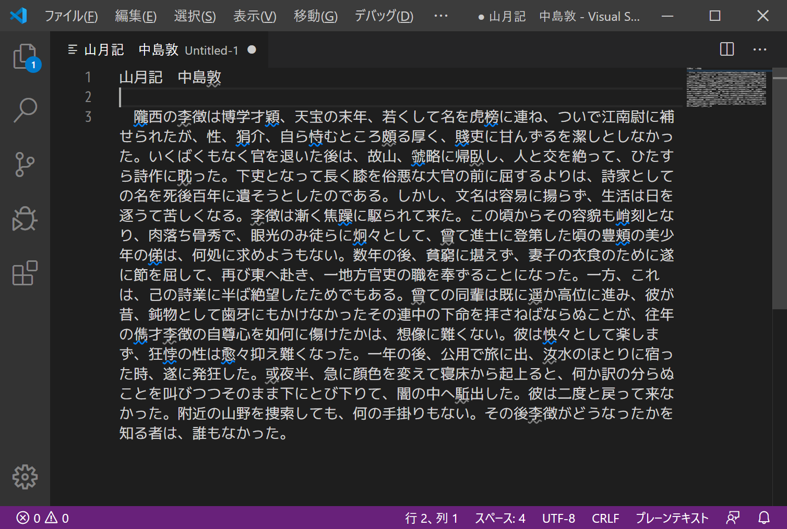

# 表外漢字チェッカー README

テキスト内の表外漢字（人名用漢字を含む常用外漢字）を強調表示させるVisual Studio Code用拡張機能です。

デフォルトの設定では、人名用漢字は灰色の波線、それ以外の常用外漢字は青色の波線が引かれます。

## 設定

* `hyogaiKanjiChecker.enabled`: 表外漢字チェッカーを有効にします。
* `hyogaiKanjiChecker.decorationStyle`: 表外漢字の強調スタイルを設定します。
* `hyogaiKanjiChecker.jinmeiyoDecorationStyle`: 人名用漢字の強調スタイルを設定します。

### 適用可能スタイル

構文および効果はCSSに準じます。

* background-color
* border
* border-color
* border-radius
* border-spacing
* border-style
* border-width
* color
* cursor
* font-style
* font-weight
* letter-spacing
* opacity
* outline
* outline-color
* outline-style
* outline-width
* text-decoration
